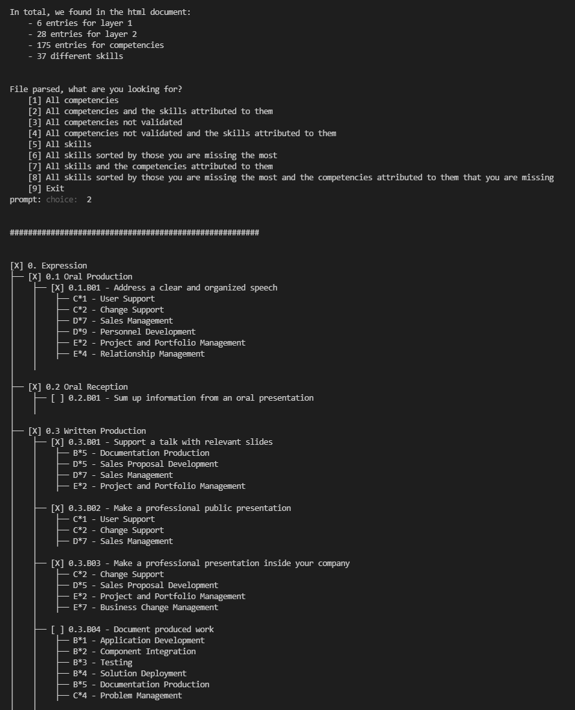
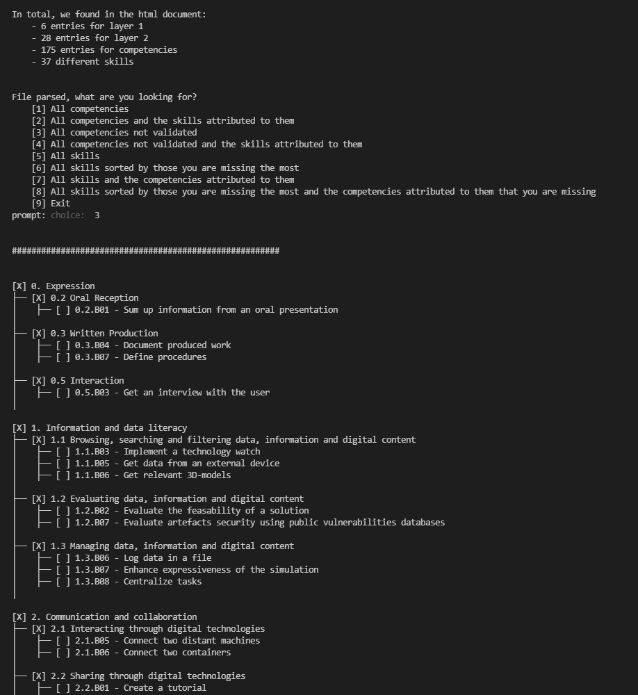
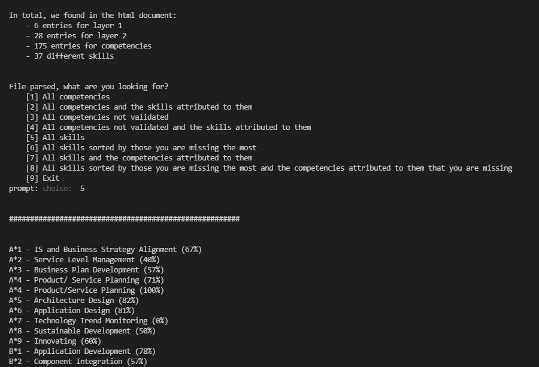
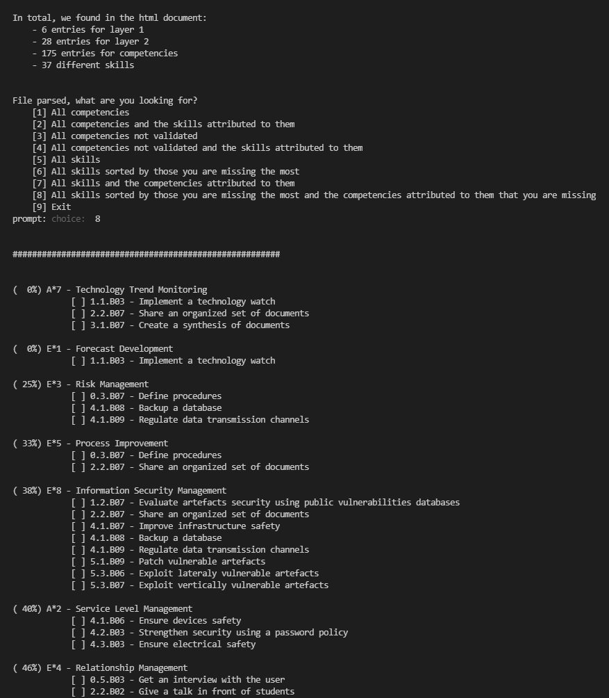

# Epitech MSc - Competencies Overview

## Setup
* You will need [NodeJS](https://nodejs.org/en/download/) to be installed 
* Run `npm install` in this directory
* Get your competency tree and store it in the `compentency_tree.html` file
  * Go to Moodle
  * Go to the competency page
  * Open your competency tree
  * Open the browser DevTools (usually F12)
  * Find the div with the class `competencyTree`, you can use Ctrl+F and search for `div.competencyTree`
  * Right-click on the div element and select "Edit as HTML"
  * Ctrl+A then Ctrl+C to copy the full content (this must include the parent div that you searched for)
  * Then paste it in `compentency_tree.html`

## Start

Run `npm start`

## Output examples

### Competencies with skills

### Non validated competencies only

### Skills

### Most missing skills with associated missing competencies

